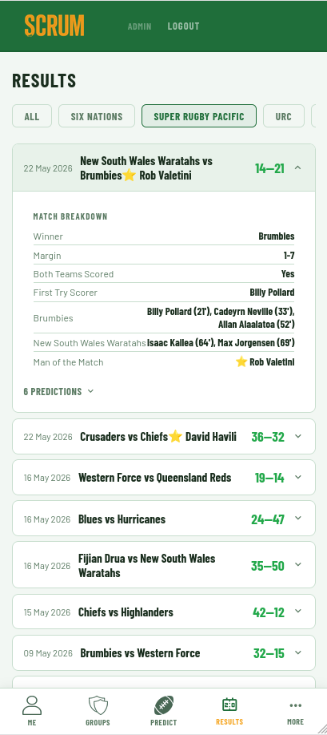
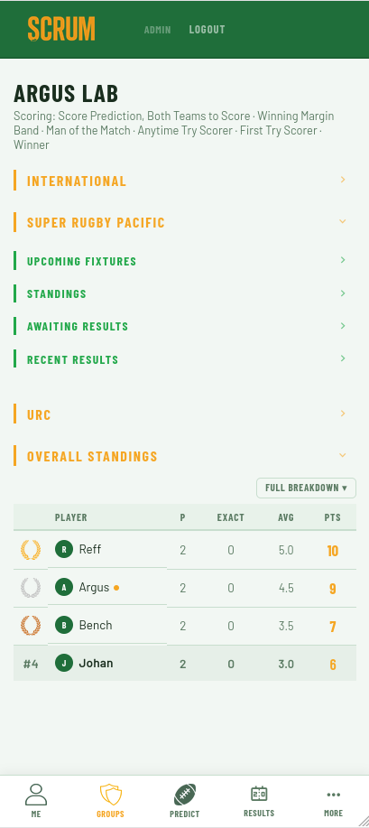
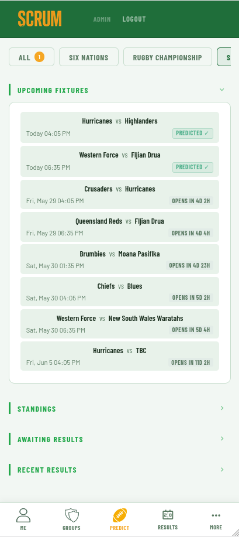
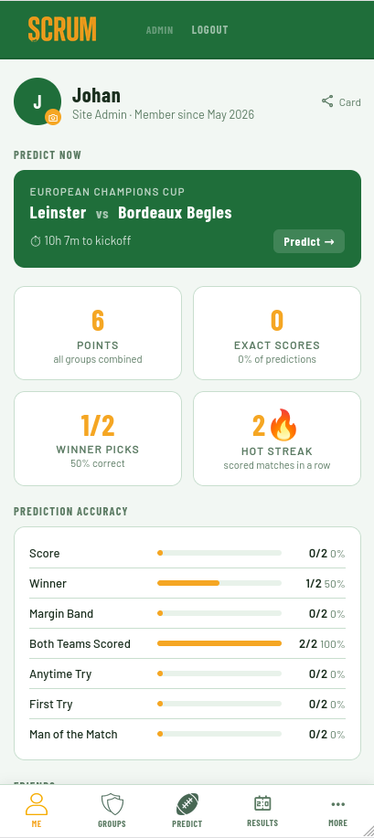
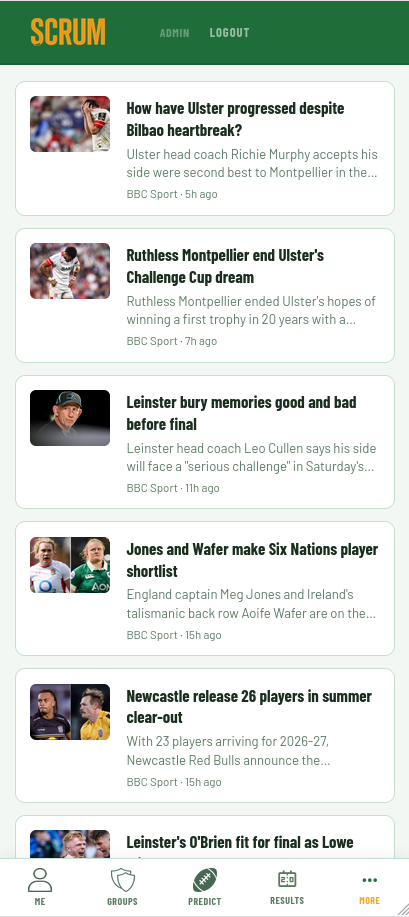

<p align="center">
  
</p>

<p align="center">
  A self-hosted rugby companion app with a prediction league built in.<br>
  Live fixtures, match results, standings and squad data across 10 competitions —<br>
  plus a full prediction game to play with your mates.
</p>

<p align="center">
  <a href="#quick-start">Quick Start</a> · <a href="#features">Features</a> · <a href="#how-auto-resolution-works">Auto-Resolution</a> · <a href="#configuration">Configuration</a>
</p>

---



---

## Features

### As a rugby companion
- Fixtures across 10 competitions — Super Rugby Pacific, URC, Six Nations, Rugby Championship, Premiership, Top 14, Champions Cup, Challenge Cup, World Cup, International
- Full match breakdowns — try scorers grouped by team with minute stamps, first try scorer, Man of the Match
- League standings updated from ESPN
- Pre-match squad data updated 48–72h before kickoff
- Rugby news feed

### As a prediction league
- 7 prediction types: Score, Winner, Margin Band, Both Teams Scored, Anytime Try Scorer, First Try Scorer, Man of the Match
- Banker pick — mark one prediction per week to double your points
- Private groups with custom league subscriptions and prediction type sets
- Full auto-resolution via ESPN + RSS scraping — no manual data entry for most matches
- Group leaderboards, personal accuracy stats, head-to-head, hot streak, shareable profile cards

### Self-hosted friendly
- One `docker compose up --build -d` and it's running
- No email server — password resets via admin-generated magic links (share on WhatsApp)
- No API keys — uses ESPN (free) and public RSS feeds
- All data stays on your server

---

## Quick Start

```bash
git clone https://github.com/Johannes1202/Scrum.git
cd Scrum
cp .env.example .env
```

Edit `.env`:

```env
ADMIN_USERNAME=admin
ADMIN_PASSWORD=changeme
SESSION_SECRET=<run: openssl rand -hex 32>
```

```bash
docker compose up --build -d
```

Open `http://localhost:8888`. Log in, create a group, invite your mates.

> **Always use `docker compose up --build -d` when updating** — `docker compose restart` uses the old image.

---

## Screenshots

| | |
|---|---|
|  |  |
| **Groups** — per-league collapsible sections with fixtures, standings, awaiting and recent results | **Predict** — upcoming fixtures across competitions with prediction status |

| | |
|---|---|
|  |  |
| **Me** — personal stats, prediction accuracy by type, hot streak, upcoming fixtures | **News** — live rugby news feed |

---

## How auto-resolution works

After the final whistle, Scrum:

1. **Fetches the result from ESPN** and scores all groups immediately
2. **Pulls try scorer data** from ESPN match summaries — each try has the scorer's name, team, and minute
3. **Scrapes Man of the Match** from 4 public RSS feeds (RugbyPass, BBC Sport, The Roar, ESPN) using article pattern matching and player ratings extraction

MOTM retries hourly for 48 hours. If it still can't find it, the admin enters it manually from the admin panel — one field, one button.

---

## Configuration

| Variable | Default | Description |
|---|---|---|
| `ADMIN_USERNAME` | — | Admin account username |
| `ADMIN_PASSWORD` | — | Admin account password |
| `SESSION_SECRET` | — | Random hex string — `openssl rand -hex 32` |
| `REDIS_URL` | `redis://redis:6379` | Redis connection (leave as-is with docker-compose) |
| `DB_PATH` | `/data/scrum.db` | SQLite database path |
| `PORT` | `8888` | Port to expose |

---

## Updating

```bash
git pull
docker compose up --build -d
```

Database migrations run automatically on startup.

---

## Exposing publicly

Works great behind Nginx or Cloudflare Tunnel.

```nginx
location / {
    proxy_pass http://localhost:8888;
    proxy_set_header Host $host;
    proxy_set_header X-Real-IP $remote_addr;
}
```

---

## Competitions

Super Rugby Pacific · URC · Six Nations · Rugby Championship · Premiership · Top 14 · Champions Cup · Challenge Cup · Rugby World Cup · International

Fixtures, results, standings and squad data pulled from ESPN. No API key required.

---

## Tech stack

Python 3.12 / FastAPI · SQLite · Redis · Docker Compose · Vanilla JS · No framework · No build step

Single-file backend. One compose file. Runs on anything with Docker.

---

## License

MIT — do whatever you want with it.

---

*Built for the guy with an old laptop and a group of rugby-mad friends.*
