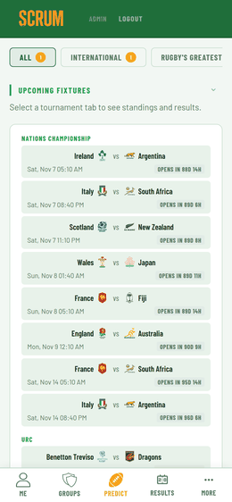

<p align="center">
  
</p>

<p align="center">
  A self-hosted rugby companion app with a prediction league built in.<br>
  Live fixtures, match results, standings and squad data across 15 competitions —<br>
  plus a full prediction game to play with your mates.
</p>

<p align="center">
  <a href="#quick-start">Quick Start</a> · <a href="#features">Features</a> · <a href="#how-auto-resolution-works">Auto-Resolution</a> · <a href="#configuration">Configuration</a> · <a href="#tests">Tests</a>
</p>

---

<p align="center"></p>

<p align="center"></p>

---

## Features

### As a rugby companion
- Fixtures across 15 competitions, with team crests throughout
- Full match breakdowns — try scorers grouped by team with minute stamps, first try scorer
- League standings from ESPN
- Squad data pulled before kickoff, so try-scorer picks come from a real team list
- Rugby news feed

### As a prediction league
- 7 scoring rules, **each switchable per group**: Score, Winner, Margin Band, Both Teams Scored, Anytime Try Scorer, First Try Scorer, and the Banker
- **Banker pick — one per group, per player, per week.** You choose it per group, so the same prediction can be your banker in one league and an ordinary pick in another. Once the match you banked has kicked off the banker is spent for that week and cannot be moved to a later fixture
- Private groups, each choosing its own competitions and its own scoring rules — shown as chips on the group card, so how a league is played is visible before you open it
- **Global league is opt-in and carries no modifiers.** Groups are where house rules live; Global is a plain, comparable measure across everyone. Whether a doubling makes sense is a question of format — a league with a full weekend round wants a banker, a group that sees a fixture every few months does not
- Group leaderboards, accuracy by prediction type, head-to-head, streaks, shareable profile cards
- Joining a group backfills your already-resolved predictions, so you don't arrive with a blank record
- **Predict Now** on your profile only offers fixtures your own groups actually cover, rather than everything the server tracks

### Seasons
Matches carry a season label — split-year for northern club competitions (`2026-27`), calendar year for everything else — so next season never piles onto this one. Archiving a season moves a group's boundary forward rather than deleting rows, keeping last season inspectable match by match.

### Derived leagues
ESPN files trophy series under a generic "International" league with no metadata to tell them apart, so Scrum declares them: an exact team pairing plus a kickoff window over a source league. That splits out **Rugby's Greatest Rivalry**, the **Puma Trophy**, the **Mandela Challenge Plate** and the **Bledisloe Cup** as competitions in their own right, leaving International as genuine miscellany.

### Fixtures ESPN doesn't have
A touring side playing a club side belongs to no league, so a league-indexed lookup structurally cannot find it. Two things cover that:

- **Manual fixtures** — declare a fixture in config or accept one from the admin panel. If ESPN later publishes it, the real event wins, matched on teams and date.
- **Discovery check** — asks a secondary source *"what's next for the teams we follow?"* and flags anything Scrum doesn't have, with **Add** and **Dismiss** on the admin page. It's a check, not a data source: it never writes match data, so a stale or wrong source costs you a bad suggestion, not a corrupted leaderboard.

### One-off events
Not every fixture belongs to a competition. A touring side playing a club side, or two
nations meeting outside any trophy, belongs to no league at all — and a group built around
a whole competition is the wrong shape for a game that happens once.

A **custom competition** inside a group holds hand-picked matches and scores them on its
own table, separate from the group's league standings. A group can follow *no* leagues at
all and exist purely for these, which makes it a one-off event: add the fixture, invite
whoever wants in, and it stands alone. Add later fixtures to the same competition — already
selected matches stay selected even once they have been played — or create a new
competition per event if you would rather each kept its own table.

### Self-hosted friendly
- One `docker compose up --build -d` and it's running
- No email server — password resets via admin-generated magic links
- No API keys required — everything comes from ESPN's free public endpoints
- Login rate limiting, expiring invite links, all data on your own server

---

## Quick Start

```bash
git clone https://github.com/Johannes1202/Scrum.git
cd Scrum
cp .env.example .env
```

Edit `.env`:

```env
ADMIN_USERNAME=admin
ADMIN_PASSWORD=changeme
SESSION_SECRET=<run: openssl rand -hex 32>
```

```bash
docker compose up --build -d
```

Open `http://localhost:8888`. Log in, create a group, invite your mates.

> **Always use `docker compose up --build -d` when updating** — `docker compose restart` reuses the old image.

---

## How auto-resolution works

After the final whistle, Scrum:

1. **Fetches the result from ESPN** and scores every group immediately
2. **Pulls try scorer data** from ESPN match summaries — each try carries the scorer, team and minute, so anytime and first-try predictions resolve on a second pass

For anything ESPN covers — which is every league competition and every Test — there is nothing to enter by hand.

**The exception worth knowing about:** ESPN does not carry every fixture. Touring matches against club sides are the known case, and for those the result has to be entered from the admin panel, including try scorers. That form takes the score and a comma-separated list of scorers, stored in exactly the shape ESPN produces, so scoring can't tell the difference. Rare, but real — plan for it if your competitions include tours.

Result correction re-scores every group automatically.

---

## Tests

```bash
./test/all.sh
```

Runs inside the app container, no extra dependencies. Covers the scoring engine
(every prediction type, per-group banker rules and the one-per-group-per-week limit,
two-pass idempotency, type-coercion regressions), custom-competition scoring,
derived-league filters, season labelling, Global opt-in and per-match deduplication,
backfill-on-join, login throttling and session tokens, plus a live check against the
real ESPN feed.

Each suite runs under a timeout, so a hang is reported as a failure rather than
silently truncating the run — a suite that leaked a database connection once blocked
the loop and stopped two of the four files from running at all, while everything it
printed still said `0 failed`.

---

## Configuration

| Variable | Default | Description |
|---|---|---|
| `ADMIN_USERNAME` | — | Admin account username |
| `ADMIN_PASSWORD` | — | Admin account password |
| `SESSION_SECRET` | — | Random hex string — `openssl rand -hex 32` |
| `REDIS_URL` | `redis://redis:6379` | Redis connection (leave as-is with docker-compose) |
| `DB_PATH` | `/data/scrum.db` | SQLite database path |
| `PORT` | `8888` | Port to expose |
| `COOKIE_SECURE` | off | Set to `1` to mark session cookies Secure. Only enable if you reach the app **exclusively** over HTTPS — it breaks plain-HTTP and LAN access |
| `RESULTS_FLOOR` | `2026-07-04` | Results before this date are not stored. The companion backfill reaches 45 days into the past, so without a floor it refills history you deliberately cleared |
| `AVATAR_DIR` | `/data/avatars` | Where profile pictures live |
| `CREST_DIR` | `/data/crests` | Where team crests are cached |
| `SPORTSDB_KEY` | `3` | Key for the discovery check's secondary source. `3` is the free development key |
| `SPORTSDB_DELAY` | `1.5` | Seconds between secondary-source requests — the free tier rate-limits |
| `DISCOVERY_INTERVAL` | `86400` | Seconds between discovery runs |

---

## Updating

```bash
git pull
docker compose up --build -d
```

Database migrations run automatically on startup.

---

## Exposing publicly

Works behind Nginx or a Cloudflare Tunnel.

```nginx
location / {
    proxy_pass http://localhost:8888;
    proxy_set_header Host $host;
    proxy_set_header X-Real-IP $remote_addr;
    proxy_set_header X-Forwarded-For $proxy_add_x_forwarded_for;
}
```

Login rate limiting reads the client address from `CF-Connecting-IP`, then
`X-Forwarded-For`, then the socket. **Forward one of those headers** — behind a
tunnel every request otherwise appears to come from the tunnel itself, and a
single shared counter would throttle all your players at once.

---

## Competitions

Nations Championship · Super Rugby Pacific · URC · Six Nations · Premiership · Top 14 ·
Champions Cup · Challenge Cup · Rugby World Cup · International · Rugby's Greatest Rivalry ·
Puma Trophy · Mandela Challenge Plate · Bledisloe Cup

The Rugby Championship is configured but dormant — SANZAAR dropped it for 2026 and 2030;
it returns in 2027.

Fixtures, results, standings, squads and crests come from ESPN. No API key required.

---

## Tech stack

Python 3.12 / FastAPI · SQLite · Redis · Docker Compose · Vanilla JS · No framework · No build step

Single-file backend. One compose file. Runs on anything with Docker.

---

## License

MIT — do whatever you want with it.

---

*Built for the guy with an old laptop and a group of rugby-mad friends.*
